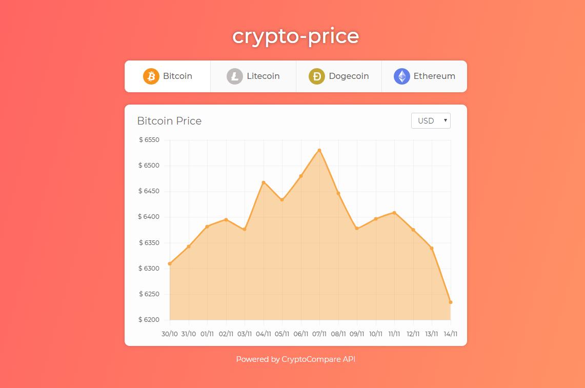

# crypto-price

> A React app which shows the price of cryptocurrencies.

**crypto-price** is a *open-source* project which uses [CryptoCompare API](https://min-api.cryptocompare.com/) to browse and retrieve the cryptocurrency price *(Bitcoin, Litecoin, Dogecoin or Ethereum)* of the last days.

[**Demo available here!**](http://crypto-price.surge.sh)

<p align="center">
  
</p>

## Using

First of all, you need to clone or download this repository.

```
git clone https://github.com/viniciusmeneses/crypto-price.git
```

Go to the **crypto-price** folder and install the dependencies

```
npm install
```

Run one of the following commands to start use **crypto-price**:

```
// Starts development webserver
npm start

// Builds the application to production
npm run build
```
